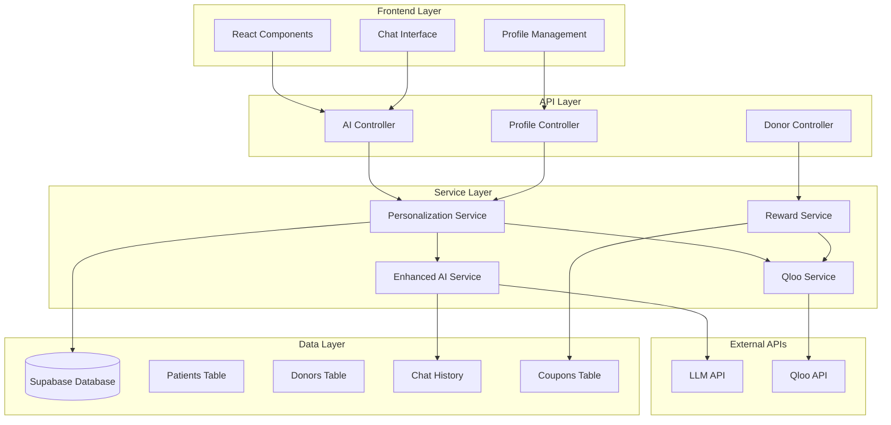

# Design Document

## Overview

The AI Personalization System enhances the existing Blood Warriors platform by integrating LLM capabilities with Qloo's taste intelligence API to provide personalized experiences. The system builds upon the existing AIService and QlooService infrastructure to deliver two main features:

1. **Empathetic Companion**: Personalized chat responses for patients based on their interests
2. **Donor Perks Program**: Interest-based coupon matching and rewards for donors

The design leverages the existing database schema where donors already have `qloo_taste_keywords` fields, and extends this capability to patients by adding a similar `taste_keywords` field.

## Architecture

### High-Level Architecture



### Data Flow Architecture

**Patient Chat Flow:**

1. Patient sends message → AI Controller
2. Controller retrieves patient interests → Personalization Service
3. Service enriches context with Qloo data → Enhanced AI Service
4. AI Service generates personalized response → LLM API
5. Response saved to chat history and returned to user

**Donor Reward Flow:**

1. Donation completed → Reward Service triggered
2. Service retrieves donor interests → Qloo API for enrichment
3. Enriched interests matched against available coupons
4. Matching coupon assigned to donor → Database updated
5. Notification sent to donor

## Components and Interfaces

### 1. PersonalizationService

**Purpose**: Central service for managing user interest data and coordinating personalization features.

**Key Methods**:

```javascript
class PersonalizationService {
  // Interest Management
  async updatePatientInterests(patientId, interests)
  async updateDonorInterests(donorId, interests)
  async getEnrichedInterests(userId, userType)

  // Context Building
  async buildPersonalizedContext(userId, userType, conversationHistory)
  async enrichContextWithQloo(baseInterests)

  // Validation
  validateInterests(interests)
  sanitizeInterests(interests)
}
```

**Dependencies**: QlooService, Patient/Donor models, Supabase

### 2. Enhanced AIService

**Purpose**: Extends existing AIService with personalization capabilities.

**Key Enhancements**:

```javascript
class AIService {
  // Enhanced existing method
  async generateChatResponse(userId, prompt, userType = 'patient')

  // New personalization methods
  async buildPersonalizedPrompt(userId, prompt, userType)
  async getPersonalizedContext(userId, userType)
  async generateInterestBasedSuggestions(interests, mood, context)

  // Fallback handling
  async getPersonalizedFallback(prompt, interests)
}
```

**New Features**:

- Interest-aware prompt construction
- Personalized fallback responses
- Context enrichment with user preferences
- Mood-based suggestion generation

### 3. RewardService

**Purpose**: Manages the donor perks program and coupon matching.

**Key Methods**:

```javascript
class RewardService {
  // Reward Processing
  async processDonationReward(donationId, donorId)
  async matchCouponsToInterests(enrichedInterests)
  async assignCouponToUser(donorId, couponId)

  // Interest Matching
  async findMatchingCoupons(interests, limit = 5)
  async calculateMatchScore(couponKeywords, userInterests)

  // Notification
  async notifyDonorOfReward(donorId, couponId)
}
```

**Dependencies**: QlooService, Coupon model, NotificationService

### 4. Database Schema Extensions

**Patient Table Enhancement**:

```sql
ALTER TABLE public.patients
ADD COLUMN taste_keywords JSONB DEFAULT '[]'::jsonb;

-- Add index for performance
CREATE INDEX idx_patients_taste_keywords ON patients USING GIN (taste_keywords);
```

**New Indexes for Performance**:

```sql
-- Optimize coupon matching queries
CREATE INDEX idx_coupons_target_keywords ON coupons USING GIN (target_keywords);

-- Optimize chat history queries with interests
CREATE INDEX idx_chathistory_user_timestamp ON chathistory (user_id, timestamp DESC);
```

## Data Models

### Enhanced Patient Model

```javascript
// Extended Patient interface
{
  patient_id: string,
  user_id: string,
  blood_group_id: string,
  medical_condition: string,
  taste_keywords: string[], // New field
  created_at: timestamp,
  updated_at: timestamp
}
```

### Enhanced Chat Context Model

```javascript
// Personalized chat context
{
  userId: string,
  userType: 'patient' | 'donor',
  baseInterests: string[],
  enrichedInterests: string[],
  conversationHistory: ChatMessage[],
  personalizedPrompt: string,
  contextMetadata: {
    qlooEnrichmentUsed: boolean,
    fallbackMode: boolean,
    interestsLastUpdated: timestamp
  }
}
```

### Reward Matching Model

```javascript
// Coupon matching result
{
  donorId: string,
  matchedCoupons: [{
    couponId: string,
    matchScore: number,
    matchingKeywords: string[],
    partnerName: string,
    description: string
  }],
  selectedCoupon: string,
  assignmentTimestamp: timestamp
}
```

## Error Handling

### Graceful Degradation Strategy

**Qloo API Unavailable**:

- Fall back to using base interest keywords
- Log degradation for monitoring
- Continue with reduced personalization

**LLM API Unavailable**:

- Use enhanced fallback responses with interest context
- Maintain conversation flow with predefined responses
- Queue requests for retry when service recovers

**Database Issues**:

- Cache recent interest data in memory
- Use default interests for new users
- Implement circuit breaker pattern

### Error Response Patterns

```javascript
// Standardized error responses
{
  status: 'error',
  message: 'User-friendly error message',
  code: 'SPECIFIC_ERROR_CODE',
  fallbackUsed: boolean,
  retryAfter?: number
}
```

### Monitoring and Logging

**Key Metrics to Track**:

- Personalization success rate
- Qloo API response times and failures
- LLM response quality scores
- Coupon matching accuracy
- User engagement with personalized features

**Logging Strategy**:

- Structured logging with correlation IDs
- Performance metrics for each service call
- User interaction patterns (anonymized)
- Error rates and degradation events

## Testing Strategy

### Unit Testing

**PersonalizationService Tests**:

- Interest validation and sanitization
- Context building with various user types
- Qloo integration error handling
- Performance with large interest arrays

**Enhanced AIService Tests**:

- Personalized prompt generation
- Fallback response quality
- Context enrichment accuracy
- Response time optimization

**RewardService Tests**:

- Coupon matching algorithm accuracy
- Interest scoring calculations
- Notification delivery
- Edge cases (no matching coupons)

### Integration Testing

**End-to-End Chat Flow**:

- Patient with interests → personalized response
- Patient without interests → generic response
- Qloo API failure → graceful degradation
- LLM failure → fallback responses

**Reward System Flow**:

- Donation completion → reward processing
- Interest matching → coupon assignment
- Notification delivery → user confirmation
- Multiple donations → reward variety

### Performance Testing

**Load Testing Scenarios**:

- Concurrent chat requests with personalization
- Bulk donation processing for rewards
- Qloo API rate limiting behavior
- Database query performance with large datasets

**Benchmarks**:

- Chat response time: < 3 seconds (95th percentile)
- Reward processing: < 10 seconds per donation
- Interest update: < 1 second
- Qloo enrichment: < 2 seconds

### User Acceptance Testing

**Patient Experience**:

- Interest collection during onboarding
- Personalized chat responses quality
- Suggestion relevance and helpfulness
- Privacy and data control

**Donor Experience**:

- Interest management in profile
- Reward notification timing
- Coupon relevance and value
- Redemption process flow

## Security Considerations

### Data Privacy

**Interest Data Protection**:

- Encrypt taste_keywords fields at rest
- Anonymize data sent to Qloo API
- Implement data retention policies
- Provide user data deletion capabilities

**API Security**:

- Rate limiting for personalization endpoints
- Input validation and sanitization
- Secure API key management for Qloo
- Audit logging for sensitive operations

### Access Control

**User Data Access**:

- Users can only access their own interest data
- Admin users have read-only access for support
- Service accounts have minimal required permissions
- Regular access review and rotation

## Performance Optimization

### Caching Strategy

**Interest Data Caching**:

- Cache enriched interests for 24 hours
- Invalidate cache on user interest updates
- Use Redis for distributed caching
- Implement cache warming for active users

**Response Caching**:

- Cache common personalized responses
- Use user interest hash as cache key
- Implement cache versioning for updates
- Monitor cache hit rates and optimize

### Database Optimization

**Query Optimization**:

- Use GIN indexes for JSONB interest fields
- Optimize coupon matching queries
- Implement query result pagination
- Use connection pooling for high load

**Data Archiving**:

- Archive old chat history data
- Compress historical interest data
- Implement data lifecycle policies
- Monitor database growth and performance
