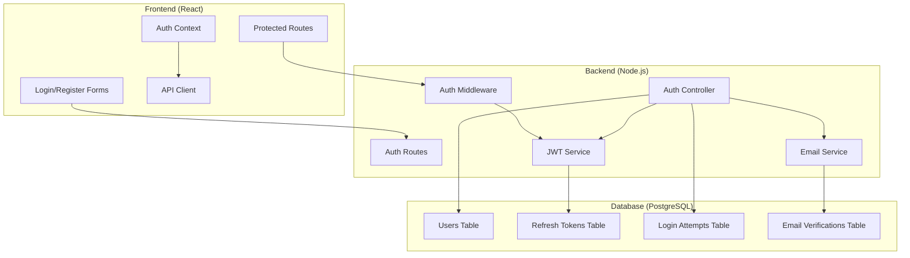
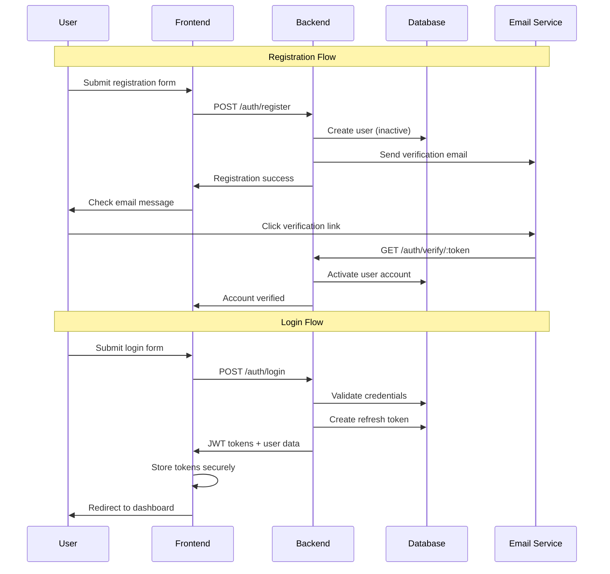

# Authentication System Redesign - Design Document

## Overview

This design document outlines a complete redesign of the Blood Warriors authentication system to follow industry standards. The new system will use JWT-based authentication with proper security measures, clean separation of concerns, and improved user experience.

## Architecture

### High-Level Architecture



### Authentication Flow



## Components and Interfaces

### Backend Components

#### 1. JWT Service (`src/services/JWTService.js`)

```javascript
class JWTService {
  generateAccessToken(payload)     // 15min expiry
  generateRefreshToken(payload)    // 7day expiry
  verifyAccessToken(token)         // Verify and decode
  verifyRefreshToken(token)        // Verify refresh token
  revokeToken(tokenId)            // Blacklist token
}
```

#### 2. Auth Controller (`src/controllers/AuthController.js`)

```javascript
class AuthController {
  register(req, res)               // User registration
  login(req, res)                  // User login
  logout(req, res)                 // User logout
  refreshToken(req, res)           // Token refresh
  verifyEmail(req, res)            // Email verification
  forgotPassword(req, res)         // Password reset request
  resetPassword(req, res)          // Password reset
  changePassword(req, res)         // Change password
  getProfile(req, res)             // Get user profile
}
```

#### 3. Auth Middleware (`src/middleware/AuthMiddleware.js`)

```javascript
class AuthMiddleware {
  authenticate(req, res, next)     // Verify JWT token
  authorize(roles)                 // Role-based access
  rateLimiter(req, res, next)     // Rate limiting
  loginAttempts(req, res, next)   // Track failed attempts
}
```

#### 4. Password Service (`src/services/PasswordService.js`)

```javascript
class PasswordService {
  hashPassword(password)           // Hash with bcrypt
  comparePassword(password, hash)  // Compare passwords
  validateStrength(password)       // Password strength
  generateResetToken()            // Secure reset token
}
```

#### 5. Email Service (`src/services/EmailService.js`)

```javascript
class EmailService {
  sendVerificationEmail(user, token)
  sendPasswordResetEmail(user, token)
  sendLoginNotification(user, loginInfo)
  sendSecurityAlert(user, alertType)
}
```

### Frontend Components

#### 1. Auth Context (`src/contexts/AuthContext.js`)

```javascript
const AuthContext = {
  user: null,
  profile: null,
  loading: false,
  isAuthenticated: false,

  // Methods
  login(email, password),
  register(userData),
  logout(),
  refreshToken(),
  updateProfile(data),
  changePassword(oldPassword, newPassword)
}
```

#### 2. Auth Hooks (`src/hooks/useAuth.js`)

```javascript
const useAuth = () => {
  // Returns auth context with helper methods
  return {
    ...authContext,
    isLoading,
    hasRole(role),
    requireAuth(),
    redirectIfAuthenticated()
  }
}
```

#### 3. Protected Route Component (`src/components/ProtectedRoute.js`)

```javascript
const ProtectedRoute = ({ children, requiredRole }) => {
  // Handles authentication checks and redirects
};
```

#### 4. API Client (`src/services/ApiClient.js`)

```javascript
class ApiClient {
  constructor()                    // Setup interceptors
  setAuthToken(token)             // Set auth header
  refreshAuthToken()              // Auto-refresh logic
  handleAuthError(error)          // Handle 401/403 errors
}
```

## Data Models

### Database Schema Updates

#### Users Table (Enhanced)

```sql
CREATE TABLE users (
  user_id SERIAL PRIMARY KEY,
  email VARCHAR(255) UNIQUE NOT NULL,
  password_hash VARCHAR(255) NOT NULL,
  full_name VARCHAR(255) NOT NULL,
  phone_number VARCHAR(20) UNIQUE NOT NULL,
  city VARCHAR(100),
  state VARCHAR(100),
  user_type user_type_enum NOT NULL,
  is_active BOOLEAN DEFAULT false,
  is_verified BOOLEAN DEFAULT false,
  last_login TIMESTAMP,
  failed_login_attempts INTEGER DEFAULT 0,
  locked_until TIMESTAMP,
  created_at TIMESTAMP DEFAULT CURRENT_TIMESTAMP,
  updated_at TIMESTAMP DEFAULT CURRENT_TIMESTAMP
);
```

#### Refresh Tokens Table (New)

```sql
CREATE TABLE refresh_tokens (
  token_id SERIAL PRIMARY KEY,
  user_id INTEGER REFERENCES users(user_id) ON DELETE CASCADE,
  token_hash VARCHAR(255) NOT NULL,
  expires_at TIMESTAMP NOT NULL,
  created_at TIMESTAMP DEFAULT CURRENT_TIMESTAMP,
  revoked_at TIMESTAMP,
  device_info JSONB
);
```

#### Email Verifications Table (New)

```sql
CREATE TABLE email_verifications (
  verification_id SERIAL PRIMARY KEY,
  user_id INTEGER REFERENCES users(user_id) ON DELETE CASCADE,
  token_hash VARCHAR(255) NOT NULL,
  expires_at TIMESTAMP NOT NULL,
  verified_at TIMESTAMP,
  created_at TIMESTAMP DEFAULT CURRENT_TIMESTAMP
);
```

#### Password Resets Table (New)

```sql
CREATE TABLE password_resets (
  reset_id SERIAL PRIMARY KEY,
  user_id INTEGER REFERENCES users(user_id) ON DELETE CASCADE,
  token_hash VARCHAR(255) NOT NULL,
  expires_at TIMESTAMP NOT NULL,
  used_at TIMESTAMP,
  created_at TIMESTAMP DEFAULT CURRENT_TIMESTAMP
);
```

#### Login Attempts Table (New)

```sql
CREATE TABLE login_attempts (
  attempt_id SERIAL PRIMARY KEY,
  email VARCHAR(255) NOT NULL,
  ip_address INET,
  user_agent TEXT,
  success BOOLEAN NOT NULL,
  failure_reason VARCHAR(100),
  attempted_at TIMESTAMP DEFAULT CURRENT_TIMESTAMP
);
```

## Error Handling

### Standardized Error Responses

```javascript
// Success Response
{
  success: true,
  data: { ... },
  message: "Operation successful"
}

// Error Response
{
  success: false,
  error: {
    code: "AUTH_INVALID_CREDENTIALS",
    message: "Invalid email or password",
    details: { ... }
  }
}
```

### Error Codes

- `AUTH_INVALID_CREDENTIALS` - Invalid login credentials
- `AUTH_ACCOUNT_LOCKED` - Account temporarily locked
- `AUTH_EMAIL_NOT_VERIFIED` - Email verification required
- `AUTH_TOKEN_EXPIRED` - JWT token expired
- `AUTH_TOKEN_INVALID` - Invalid JWT token
- `AUTH_INSUFFICIENT_PERMISSIONS` - Insufficient permissions
- `AUTH_PASSWORD_WEAK` - Password doesn't meet requirements
- `AUTH_EMAIL_EXISTS` - Email already registered
- `AUTH_RATE_LIMITED` - Too many requests

## Testing Strategy

### Unit Tests

- JWT Service token generation/validation
- Password hashing and comparison
- Email service functionality
- Auth middleware validation

### Integration Tests

- Complete registration flow
- Login/logout flow
- Token refresh mechanism
- Password reset flow
- Email verification flow

### Security Tests

- JWT token tampering
- SQL injection attempts
- Rate limiting effectiveness
- Password strength validation
- Session management security

### End-to-End Tests

- User registration journey
- Login and navigation
- Password reset process
- Account verification
- Multi-device sessions

## Security Considerations

### Password Security

- Minimum 12 rounds of bcrypt hashing
- Password strength requirements (8+ chars, mixed case, numbers, symbols)
- Password history to prevent reuse
- Secure password reset tokens

### JWT Security

- Short-lived access tokens (15 minutes)
- Secure refresh token rotation
- Token blacklisting capability
- Proper token storage (httpOnly cookies for refresh tokens)

### Session Security

- CSRF protection
- Secure cookie settings
- Session timeout handling
- Device tracking and management

### Rate Limiting

- Login attempt limiting (5 attempts per 15 minutes)
- API rate limiting (100 requests per minute)
- Email sending limits
- Progressive delays for failed attempts

### Data Protection

- Input validation and sanitization
- SQL injection prevention
- XSS protection
- Sensitive data encryption at rest

## Performance Considerations

### Caching Strategy

- JWT token validation caching
- User profile caching
- Rate limiting counters in Redis
- Session data caching

### Database Optimization

- Proper indexing on email, user_id
- Connection pooling
- Query optimization
- Cleanup jobs for expired tokens

### Frontend Optimization

- Token refresh background processing
- Optimistic UI updates
- Proper loading states
- Error boundary implementation

## Migration Strategy

### Phase 1: Backend Infrastructure

1. Create new database tables
2. Implement JWT service
3. Create new auth controllers
4. Add security middleware

### Phase 2: API Endpoints

1. Implement new auth endpoints
2. Add comprehensive validation
3. Implement email services
4. Add logging and monitoring

### Phase 3: Frontend Integration

1. Update auth context
2. Implement new auth hooks
3. Update login/register forms
4. Add protected routes

### Phase 4: Testing and Deployment

1. Comprehensive testing
2. Security audit
3. Performance testing
4. Gradual rollout

### Phase 5: Legacy Cleanup

1. Remove Supabase Auth dependencies
2. Clean up old auth code
3. Update documentation
4. Monitor and optimize
